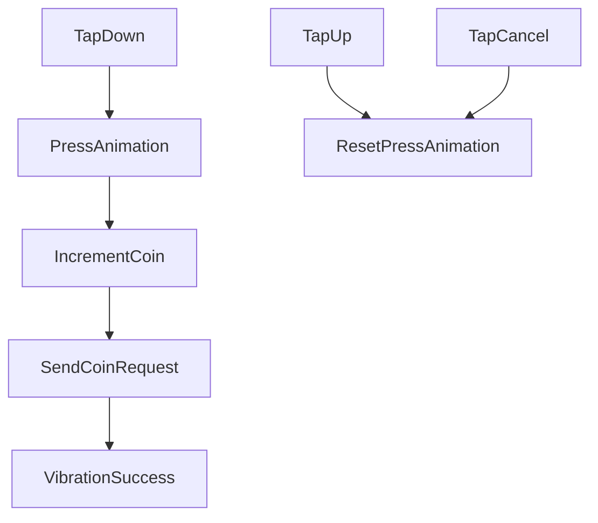

# CoinCounterActionComponent Documentation

This document describes the `CoinCounterActionComponent` Flutter widget, its methods, and their roles within the component.

---

## Overview
`CoinCounterActionComponent` is a `StatefulWidget` that allows users to increment a coin counter visually and interact with backend APIs while providing feedback via animations and vibrations.

It animates a counter, shows visual coin flying effects, and handles tip actions with external service communication.

---

## Methods Documentation

### 1. `initState()`
Initializes the state variables:
- Retrieves initial coin count and content ID.
- Configures animation controllers for tooltip, press scaling, sliding and fading.

**Example:**
```dart
@override
void initState() {
  super.initState();
  _coinCount = (widget.content['settings']?['tip_owner'] ?? 0.0).toDouble();
  _contentId = widget.content['id'];
  // Initialize controllers
}
```

### 2. `dispose()`
Properly disposes of the animation controllers to prevent memory leaks.

**Example:**
```dart
@override
void dispose() {
  _tooltipController.dispose();
  _pressController.dispose();
  super.dispose();
}
```

### 3. `_incrementCoin()`
Handles the logic for incrementing the coin count and shows the tooltip animation.

**Example:**
```dart
await _incrementCoin();
```

### 4. `vibrateStrongAndShort()`
Triggers a strong, short vibration (200ms, amplitude 255) if supported by the device.

**Example:**
```dart
await vibrateStrongAndShort();
```

### 5. `_sendCoinRequest()`
Sends a POST request to `/profile/coins` endpoint.
Currently vibrates briefly to simulate request.

**Example:**
```dart
await _sendCoinRequest();
```

### 6. `_onTapDown(TapDownDetails details)`
Begins the press animation and triggers actions after completion.

**Example:**
```dart
// GestureDetector(
//   onTapDown: _onTapDown,
// )
```

### 7. `_onTapUp(TapUpDetails details)`
Resets the press animation when the tap is lifted.

**Example:**
```dart
// GestureDetector(
//   onTapUp: _onTapUp,
// )
```

### 8. `_onTapCancel()`
Resets the press animation if the tap gesture is cancelled.

**Example:**
```dart
// GestureDetector(
//   onTapCancel: _onTapCancel,
// )
```

### 9. `build(BuildContext context)`
Constructs the visual layout of the component with animated feedback.

**Example:**
```dart
@override
Widget build(BuildContext context) {
  return Stack(
    children: [
      // UI structure
    ],
  );
}
```

---

## Visual Structure
- Main counter and coin icon inside a `Row`.
- Animated scale effect during press.
- Animated flying coins as tooltip effects.

---

## External Dependencies
- `ContentProvider` for tipping API communication.
- `DioClientService` for future external requests.
- `vibration` package for device vibration control.

---

## Potential Improvements
- Implement real POST request logic inside `_sendCoinRequest`.
- Enhance vibration feedback with custom patterns.
- Add error handling visuals if POST request fails.

---

## Notes
- Assumes vibration permissions are handled.
- Optimized for a responsive and dynamic user interaction experience.

---

## Flowchart



---

*Generated by AI based on provided code.*
